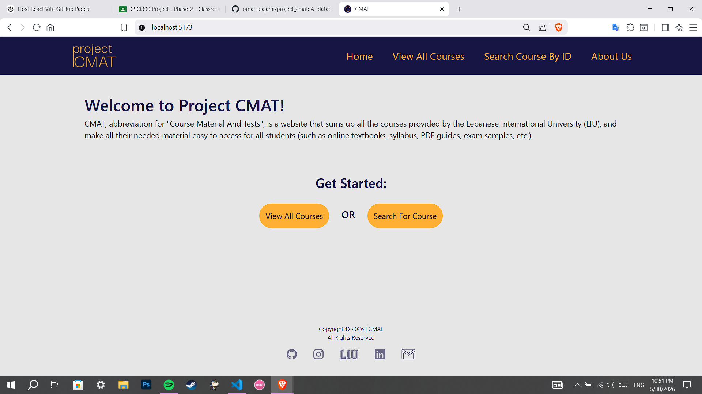
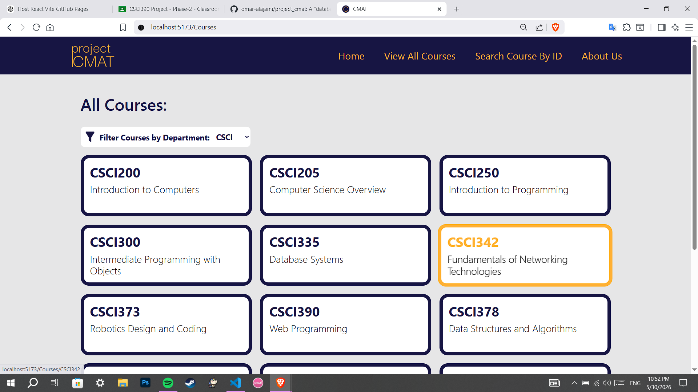
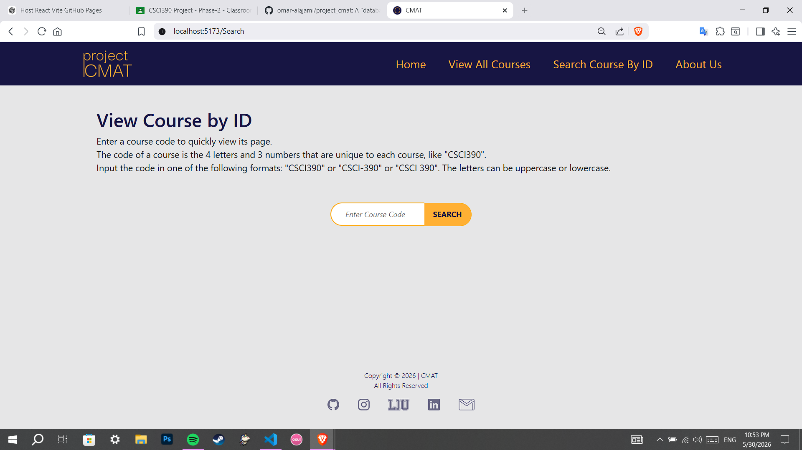
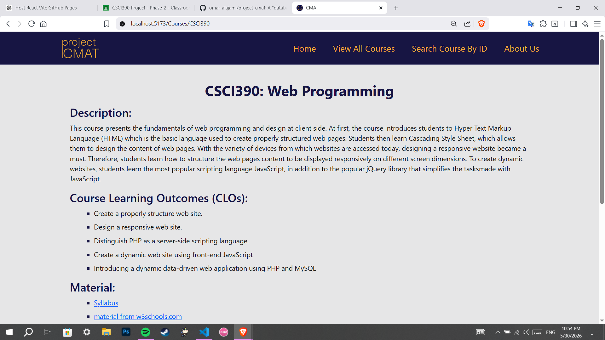
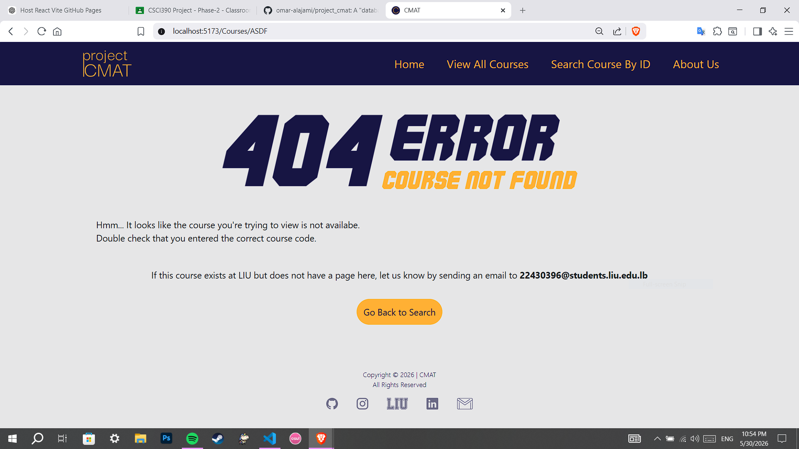

# CMAT | ReactJS project for CSCI390

## Project Description

CMAT, abbreviation for "Course Material And Tests", is a website that sums up all the courses provided by the Lebanese International University (LIU), and make all their needed material easy to access for all students (such as online textbooks, syllabus, PDF guides, exam samples, etc.).

## Setup Instructions

There's no real "setup"; anyone can access all features of the website without needing to do anything (such as login/signup or anything similar).

If by "setup instructions" you mean how the user uses the website, they would either go to the search page and input the course code for the course they want to see, or go to the "view all courses" page and search for the course they want.

## Screenshots of the UI

Home Page:

View All Courses:

Search Page:

Specific Course Page:

Searching for Course that doesn't exist:
